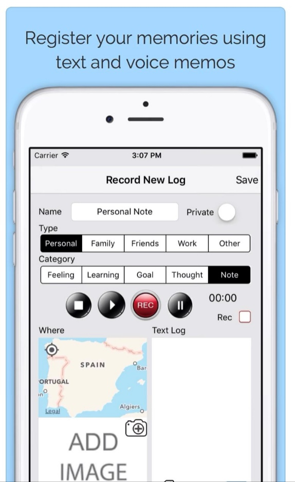

# AI Developer Resources

AI Developer Resources is a collection of code samples and resource links.

## Code Samples

You can find the following code samples on the links below. Check out the demo folder Readme file for more instructions on how to setup the projects and related documentation links.

-   [AI Blog Intelligent Travel Journey](./AIBlog-IntelligentTravelJournal)

[

<!-- -   Feature 2
-   ... -->

<!-- ## Getting Started

### Prerequisites

(ideally very short, if any)

-   OS
-   Library version
-   ...

### Installation

(ideally very short)

-   npm install [package name]
-   mvn install
-   ...

### Quickstart

(Add steps to get up and running quickly)

1. git clone [repository clone url]
2. cd [respository name]
3. ...

## Demo

A demo app is included to show how to use the project.

To run the demo, follow these steps:

(Add steps to start up the demo)

1.
2.
3. -->

## Resources

### Speech

-   [Speech Service Documentation](https://docs.microsoft.com/azure/cognitive-services/speech-service/?WT.mc_id=aiml-13155-ayyonet)
-   [Speech SDK Samples](https://github.com/Azure-Samples/cognitive-services-speech-sdk?WT.mc_id=aiml-13155-ayyonet)
-   [Batch client, converting to a class library code sample](https://github.com/Azure-Samples/cognitive-services-speech-sdk/tree/master/samples/batch/csharp/batchclient?WT.mc_id=aiml-13155-ayyonet)
-   [Speech Recognizer Class Reference](https://docs.microsoft.com/dotnet/api/microsoft.cognitiveservices.speech.speechrecognizer?view=azure-dotnet&WT.mc_id=aiml-13155-ayyonet)
-   [Speech to Text Documentation](https://docs.microsoft.com/azure/cognitive-services/speech-service/index-speech-to-text?WT.mc_id=aiml-13155-ayyonet)
-   [How to use batch transcription](https://docs.microsoft.com/azure/cognitive-services/speech-service/batch-transcription?WT.mc_id=aiml-13155-ayyonet)
-   [Speech SDK Samples](https://github.com/Azure-Samples/cognitive-services-speech-sdk?WT.mc_id=aiml-13155-ayyonet)
-   [Batch client code sample](https://github.com/Azure-Samples/cognitive-services-speech-sdk/tree/master/samples/batch/csharp/batchclient?WT.mc_id=aiml-13155-ayyonet)
-   [Speech Recognizer API](https://docs.microsoft.com/dotnet/api/microsoft.cognitiveservices.speech.speechrecognizer?view=azure-dotnet&WT.mc_id=aiml-13155-ayyonet)
    https://docs.microsoft.com/en-us/dotnet/api/microsoft.cognitiveservices.speech.speechrecognizer?view=azure-dotnet
-   [Speech translation code sample](https://github.com/Azure-Samples/cognitive-services-speech-sdk/blob/master/quickstart/csharp/dotnet/translate-speech-to-text/helloworld/Program.cs?WT.mc_id=aiml-13155-ayyonet)

### Computer Vision

-  [Computer Vision Documentation](https://docs.microsoft.com/azure/cognitive-services/computer-vision/?WT.mc_id=aiml-13155-ayyonet)
-   [Add metadata to image blobs](https://docs.microsoft.com/azure/cognitive-services/computer-vision/tutorials/storage-lab-tutorial?WT.mc_id=aiml-13155-ayyonet)
-   [Computer Vision Documentation](https://docs.microsoft.com/azure/cognitive-services/computer-vision/?WT.mc_id=aiml-13155-ayyonet)
-   [Quickstart: Use Computer Vision Client LIbrary](https://docs.microsoft.com/azure/cognitive-services/computer-vision/quickstarts-sdk/client-library?tabs=visual-studio&pivots=programming-language-csharp&WT.mc_id=aiml-13155-ayyonet)
-   [Quickstart Sample Code](https://github.com/Azure-Samples/cognitive-services-quickstart-code/blob/master/dotnet/ComputerVision/ComputerVisionQuickstart.cs?WT.mc_id=aiml-13155-ayyonet)
-   [Azure Search Documentation](https://docs.microsoft.com/azure/search/?WT.mc_id=aiml-13155-ayyonet)

### Cognitive Search

-   [Cognitive Search Documentation](https://docs.microsoft.com/azure/search/?WT.mc_id=aiml-13155-ayyonet)
-   [Search Client 11 - client library - using Azure.Search.Documents](https://docs.microsoft.com/dotnet/api/overview/azure/search.documents-readme?WT.mc_id=aiml-13155-ayyonet)
-   [Tutorial: Index from multiple data sources using the .NET SDK](https://docs.microsoft.com/azure/search/tutorial-multiple-data-sources?WT.mc_id=aiml-13155-ayyonet)
-   [Tutorial: AI-generated searchable content from Azure blobs using the .NET SDK](https://docs.microsoft.com/azure/search/cognitive-search-tutorial-blob-dotnet?WT.mc_id=aiml-13155-ayyonet)
-   [Azure Cognitive Search client library for .NET](https://github.com/Azure/azure-sdk-for-net/tree/master/sdk/search/Azure.Search.Documents?WT.mc_id=aiml-13155-ayyonet)
-   [Azure Cognitive Search .NET Samples](https://github.com/Azure-Samples/azure-search-dotnet-samples?WT.mc_id=aiml-13155-ayyonet)
-   [Azure Cognitive Search client library for .NET: Creating an Index](https://github.com/Azure/azure-sdk-for-net/tree/master/sdk/search/Azure.Search.Documents?WT.mc_id=aiml-13155-ayyonet#creating-an-index)

### Azure Storage

-   [Azure Storage Documentation](https://docs.microsoft.com/azure/storage/?WT.mc_id=aiml-13155-ayyonet)
-   [Azure Managed Databases Overview](https://azure.microsoft.com/solutions/databases/?WT.mc_id=aiml-13155-ayyonet)
-   [Store Application Data with Azure Storage](https://docs.microsoft.com/learn/modules/store-app-data-with-azure-blob-storage/?WT.mc_id=aiml-13155-ayyonet)
